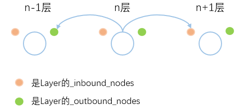

# Keras源码分析之基础框架

##### 小小的摘要
  本小节主要对Keras整体的基础架构做一个简要介绍（ps:一丢丢个人理解）:
  1. Keras的源码文件的结构
  2. Keras构建模型的基础类之间的关系及作用
  3. Keras计算的基本流程

####一、Keras的源码文件的结构
下面为Keras源码文件的主要结构：
```
|-- docs                      #说明文档
|-- examples                  #应用示例
|-- test                      #测试文件
|-- keras                     #核心源码
      |-- application         #应用实例，如VGG16,RESNET50
      |-- backend             #底层接口，如:tensorflow_backend,theano_backend
      |-- datasets            #数据获取，如boston_housing,mnist
      |-- engine              #网络架构
            |-- base_layer    #网络架构层的抽象类
            |-- network       #Network类所在，构建layer拓扑DAG
            |-- input_layer   #输入层
            |-- training      #Model类所在
            |-- training_generator  #训练函数
      |-- layers              #各类层相关实现
      |-- legacy              #遗留源码
      |-- preprocessing       #预处理函数
      |-- utils               #实用工具
      |-- wrappers            #scikit-learn封装类
      |-- activations.py      #激活函数相
      |-- callbacks.py        #回调函数
      |-- constraints.py      #权重约束，如非零约束等
      |-- initializers.py     #初始化方法
      |-- losses.py           #损失函数
      |-- metrics.py          #度量方法
      |-- models.py           #模型工具
      |-- objectives.py       #目标函数，也就是损失函数，为兼容而保留此文件
      |-- optimizers.py       #优化方法，如SGD，Adam等
      |-- regularizers.py     #正则项，如L1，L2等
```
 其中，主要介绍以下在engine目录下的代码。engine是Keras最核心部分，其中包含了Keras建模的实现逻辑：
 1. 计算层的抽象类Layer和层之间的连接Node类---base_layer.py
 2. 层的拓扑网络Network类---network.py
 3. 实现训练模型配置与建模的Model类---training.py


 ####二、Keras构建模型的基础类之间的关系及作用
 基础类之间的关系及作用如下：
 ```
|-- Layer:计算层的抽象，完成网络中对Tensor的计算过程
|      |-- Network:层拓扑连接
|            |-- Model:在Network之上封装compile\fit\evaluate\predict功能
|                  |-- Sequential:这个在keras常见的类，是对Model进一步封装
|
|-- Node:描述两个层之间连接关系的抽象，配合Layer()构建DAG；
 ```

#####class Layer(object)
Layer是计算层的抽象，其主要的处理逻辑是，给定输入，产生输出。因为各种layer作用的不同，所以在些基类中无法做具体实现，它们的具体功能留待各种子类去实现。

Layer类主要的成员变量和成员函数如下：
```
{
  "properties":
    {
      "name":"String，模型中唯一的名字",
      "input, output":"Input/output tensor(s)，输入输出",
      "input_shape, output_shape":"Shape tuple，shape元组tuple；Prefer using`layer.get_input_shape_at(node_index)`",
      "inbound_nodes, outbound_nodes":"绑定输入/输出张量,当一个输入/输出张量被另一层Layer调用时，在layer.outbound_nodes增加新的节点input_spec:class InputSpec的list。每一个元素描述了对于输入/输出的要求，例如维度ndim和数据类型dtype。",
      "_trainable_weights, _non_trainable_weights":"List of variables，可训练/不可训练变量的list;",
      "weights":"拼接的trainable_weights和non_trainable_weights的list，按此顺序；",
      "dtype":"默认层权重类型",
      ...
    },
    "Methods":
      {
        "call(x, mask=None)":"层的处理逻辑。",
        " __call__(x, mask=None)":"包装层逻辑(`call`),用于处理内部引用",
        "compute_output_shape(input_shape)":"计算层输出的形状",
        "add_metric":"向层加入评估tensor",
        "add_loss":"向层加入losses,这个函数会不断添加self.losses列表，参数losses会被转化为list然后被加到self.losses后面。然后根据参数inputs，获得它的用户级编号uid作为hash值。uid是根据python的id()函数得到的，某种意义上类似于C的内存地址",
        "add_update":"增加层的更新，更新可能以某些输入张量为条件，例如批范数更新以图层的输入为条件。基本上和losses都一样，只是将关键字losses改成updates",
        "build":"创建图层权重。必须在所有具有权重的图层上实现",
        ...
      },
}
```

Layer类定义了类的基本属性和方法：
1. 输入输出：input/output和它的shape
2. 权重：weights、\_trainable_weights、\_non\_trainable_weights
3. 层计算逻辑的实现：call(),\_\_call\_\_()
所有层的计算逻辑都是在call()中，需要在各层实现,\_\_call\_\_()是call()的封装：
```python
def call(self, inputs, **kwargs):
        return inputs
def __call__(self, inputs, **kwargs):
    ...
    self.call(inputs, **kwargs)
    ...
```

4. 特别注意在Layer类中，有两Node类的成员变量inbound_nodes, outbound_nodes。Node类是用来连接网络层。它是保存该层输入的连接；下面是Node对象的关键处理：它把自己分别追加到outbound\_layer.\_inbound\_nodes和inbound\_layers中的每个layer.\_outbound\_nodes的列表中。这样做的目的，显然是建立起从输入层到输出层关联。
```python
# Add nodes to all layers involved.
for layer in inbound_layers:
    if layer is not None:
        layer._outbound_nodes.append(self)
outbound_layer._inbound_nodes.append(self)
```
简单的画了个示意图，方便理解：



**因此，Node类负责layer拓扑的连接，用来构建DAG图。**


#####class Network(Layer)

首先，要说明的是，它为什么要继承自Layer，应该有这样几点：
1. 因为它要生成一个有向无环图（DAG），有入口也有出口，有输入也有输出，这一点跟Layer是一致的；
2. 它生成有向无环图（DAG）的目的是为了计算，为了触发DAG进行计算，就需要提供一个函数给外部调用，这个函数就是call, 这一点跟Layer是一致的；
3. Keras的模型作为一个Layer可嵌套使用。

Network类主要的成员变量和成员函数如下（为Network类中实现的部分函数），ps前面加*代表重写：
```
{
  "properties":
    {
      "_network_nodes":"网络模型种包含的所有node的实例list",
      "_nodes_by_depth":"depth到nodes实例list的映射",
      "_layers":"网络模型种包含的所有layer的实例list",
      "_layers_by_depth":"depth到layers实例list的映射",
      "_output_tensor_cache":"为了减少重复计算的开销，Network对象对同一inputs和masks的计算结果进行了缓存，已计算过的直接缓存取出"

      ...
    },
    "Methods":
      {
        "*call(x, mask=None)":"Network的处理逻辑。",
        " _init_graph_network(self, inputs, outputs, name=None, **kwargs)":"初始化网络拓扑图",
        "run_internal_graph(self, inputs, masks=None)":"内部网络图计算函数，该函数被call调用",
        "save(self, filepath, overwrite=True, include_optimizer=True)":"保存网络模型到单个HDF5文件",
        "save_weights(self, filepath, overwrite=True)":"保存所有层权重到单个HDF5文件",
        "load_weights(self, filepath, by_name=False,skip_mismatch=False, reshape=False)":"从HDF5文件中加载所有层权重",
        "summary(self, line_length=None, positions=None, print_fn=None)":"打印网络的结构",

        ...
      },
}
```

从上面的Network类成员变量和成员函数中可以看到，出去基本与Layer一致的部分（如input/output、trainable_weights/non_trainable_weights、build(),get_weights()等)，最大的作用是：
1. 构建网络的拓扑图DAG（network的核心）
2. 网络的推理计算；
3. 模型权重保存与加载；

另外，特意写一下network推理计算的调用过程:

`Network.call() --> Network.run_internal_graph()  --> Layer.call()`

部分源码：
```python
#Network类的call
def call(self, inputs, mask=None):
  ...
  if cache_key in self._output_tensor_cache:  # 检查计算结果已经在缓存
    return self._output_tensor_cache[cache_key] #在缓存则直接输出
  else:
    output_tensors, _, _ = self.run_internal_graph(inputs, masks) # 调用内部推理运算逻辑函数
    return output_tensors #输出tensor

#Network类的run_internal_graph
def run_internal_graph(self, inputs, masks=None):
  ...
  for depth in depth_keys:  #根据网络的depth顺序计算layer
    nodes = self._nodes_by_depth[depth]
    for node in nodes:
      # This is always a single layer, never a list.
      layer = node.outbound_layer # 在node连接中获取到layer (node部分暂时没细看)
      ...
      output_tensors = to_list(layer.call(computed_tensor, **kwargs)) #调用Layer实例的call计算该层输出

```

#####class Model(Network)

Model类是与用户距离最近的接口，它继承自Network，是对Network进一步封装。
Model有四大功能：
1. compile()：模型编译。用于配置训练模型。用compile接受的每一个参数对model进行配置，如optimater、metric、loss函数等等；
2. fit()：模型训练。在所有的fit函数中，传入训练数据或者验证数据，设置epochs为训练轮次和batch_size为批大小。
3. evaluate()：模型评估。在测试模式下对模型进行评估，按batch计算模型的误差损失值和其它可能的评估指标量。其代码逻辑与fit类似。
4. predict()：预测。对输入的数据x进行预测，输出为对应的预测值（numpy array）

**因此，可以Model是对Network的layer拓扑DAG图，做训练/预测功能的封装；（ps：所以model是放在keras/engine的training.py里）**

Network类主要的成员变量和成员函数如下：

```
  "properties":
    {
      "optimizer":"模型训练的optimizer",
      "loss_functions":"模型训练损失函数",
      "_compile_metrics":"模型在训练和测试期间要评估的指标metrics list",
      "loss_weights":"用于指定标量系数（Python浮点数）以加权不同模型输出的loss贡献",
      "sample_weight_mode":"样本加权"
      "total_loss":"网络模型总损失",

      ...
    },
    "Methods":
      {
        "_make_train_function(self)/_make_test_function(self)/_make_predict_function(self)":"训练/测试/预测函数接口",
        "compile(self, optimizer,
                loss=None,
                metrics=None,
                loss_weights=None,
                sample_weight_mode=None,
                weighted_metrics=None,
                target_tensors=None,
                **kwargs):":"模型训练的配置函数",
        "fit(self, ...):":"配置模型输入数据和训练epoch的接口",
        "evaluate(self, ...)":"配置模型测试接口",
        "train_on_batch(self, ...)/test_on_batch(self, ...)/predict_on_batch(self, ...)":"保对单批数据运行一次 训练梯度更新/测试/预测的接口",
        "fit_generator(self, ...)/evaluate_generator(self, ...)/predict_generator(self, ...)":"使用Python生成器逐批生成的数据训练/测试/预测模型",

        ...
      },
}
```

下面有个Model例子：
```python
import ...
x_train = np.random.random((1000,20))
y_train = keras.utils.to_categorical(np.random.randint(10, size=(1000,1)), num_classes=10)

x_test = np.random.random((100,20))
y_test = keras.utils.to_categorical(np.random.randint(10, size=(100,1)), num_classes=10)

input_x = Input(shape=(None,20))  # 这里可能有点问题，没调
d1 = Dense(64,activation='relu')(input_x)
d1 = Dropout(0.5)(d1)
d2 = Dense(64, activation='relu')(d1)
d2 = Dropout(0.5)(d2)
out = Dense(10, activation='softmax')(d2)
model = Model([input_x],[out])
model.summary() #继承Network的接口

sgd = SGD(lr=0.01, decay=1e-6, momentum=0.9, nesterov=True)
model.compile(optimizer = sgd, metrics=['accuracy'], loss='categorical_crossentropy') # Model配置训练参数

model.fit(x_train, y_train, batch_size=128, epochs=20)  # Model训练模型

score = model.evaluate(x_test, y_test, batch_size=32) # Model测试验证
print('score:',score)

weights = np.array(model.get_weights())#继承Network的接口
for weight in weights:
	print(weight.shape)
for layer in model.layers:#继承Network的成员变量
	print(layer.name)

```

##### 小小的总结
在文章上面，主要讲述了Keras整体的基础框架的，讲述脉络从基础层Layer-->拓扑构建Network-->训练配置Model来介绍。
主要目标是为了能让胖友对下面的框架，有个初步的认识。
 ```
|-- Layer:计算层的抽象，完成网络中对Tensor的计算过程 -- Layer.py
|      |-- Network:层拓扑连接 -- network.py
|            |-- Model:在Network之上封装compile\fit\evaluate\predict功能 -- training.py
|                  |-- Sequential:这个在keras常见的类，是对Model进一步封装
|
|-- Node:描述两个层之间连接关系的抽象，配合Layer()构建DAG； -- Layer.py
 ```

 因为，在整体框架了解之后，接下来可以深入下面各部分的实现细节（如network如何从output反向遍历网络，构建拓扑图；梯度计算与更新的具体细节等等）。当然也可以去了解具体layer/optimater等等实现。

当然很都是我个人粗浅理解，有问题请指正。

##### Reference
[彗双智能：机器学习与大数据](http://wangbn.blogspot.com/2019/01/keras-network.html)

[[源码笔记]keras源码分析之Layer、Tensor和Node](https://blog.ddlee.cn/posts/4943e1b8/)

*PS:我只是站在大牛肩上的哈比人*
